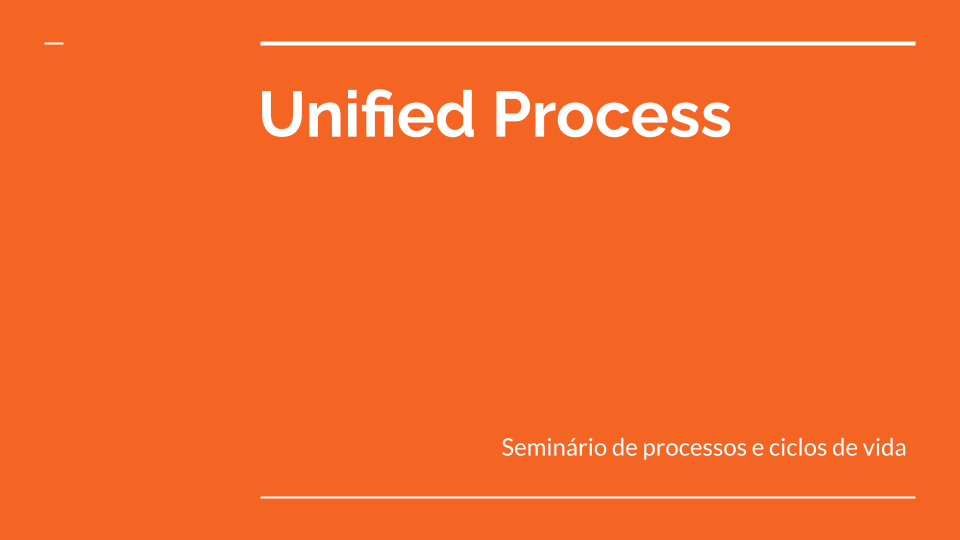
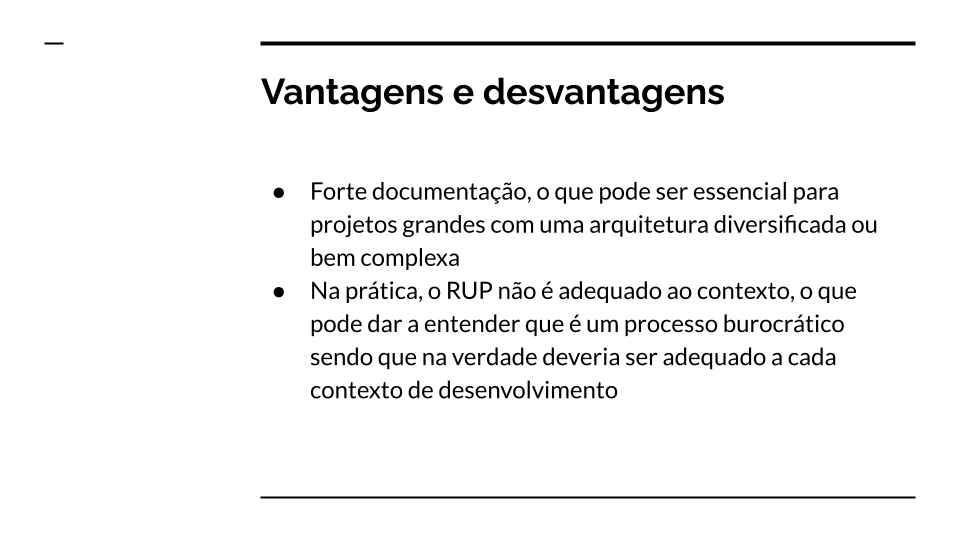
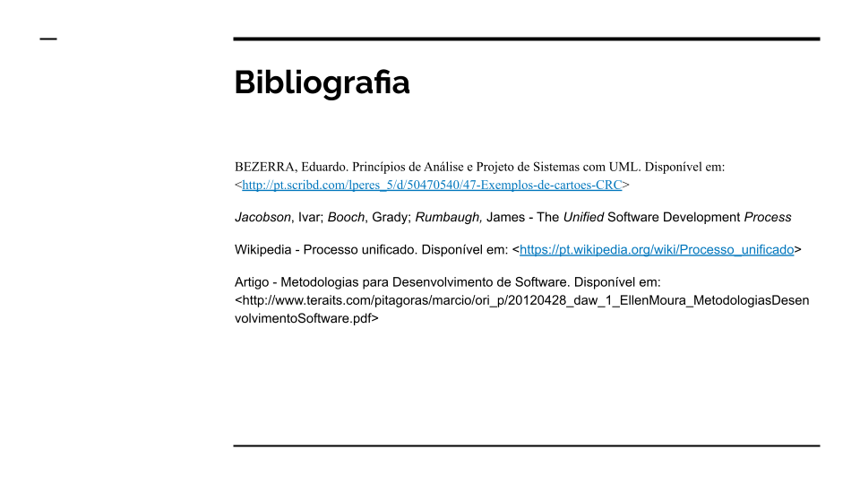

# Unidade 1

## Vídeo de apresentação

Vídeo apresentando o projeto e a documentação do projeto, feita até então  
* [Link para o vídeo](https://)

## Seminário dos processos e ciclos de vida

Apresentação sobre o processo de desenvolvimento Unificado

# Material do seminário de processos de desenvolvimento

## Histórico de revisões

| Data | Versão | Descrição | Autor |
|---|---|---|---|
| 20/04/2023 | 0.1 | Criação do documento | Kaio Enzo Melo 
| 20/04/2023 | 0.2 | Adição dos slides | Lara Giuliana
