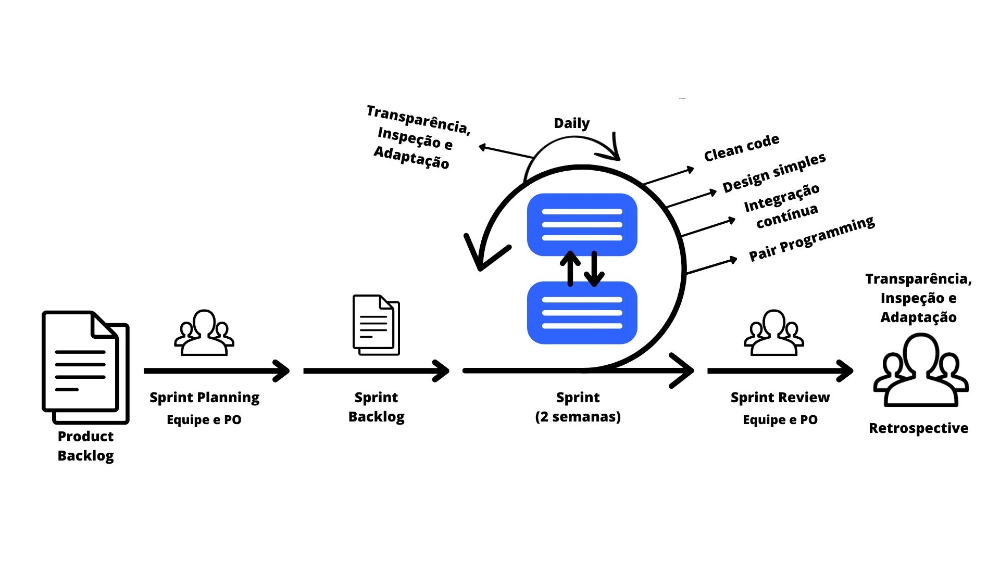

# Processo de desenvolvimento de software
Para o desenvolvimento do projeto a equipe decidiu utilizar as metodologias SCRUM com XP com ciclos de entrega iterativos e incrementais.

## SCRUM
 Eventos do SCRUM:

 - **Daily Meeting** - Reunião diária de 15 minutos para alinhar o time sobre o que foi feito, o que será feito e o que está impedindo o time de avançar.
 - **Sprint Planning** - Reunião para planejar a sprint, definir as histórias de usuário e estimar o esforço necessário para cada uma.
 - **Sprint Review** - Reunião para mostrar o que foi feito na sprint e o que ainda precisa ser feito.
 - **Sprint Retrospective** - Reunião para avaliar o que deu certo e o que deu errado na sprint e definir ações para melhorar no próximo ciclo.
 - **Product Backlog** - Lista de histórias de usuário que serão desenvolvidas no projeto.

## XP (Extreme Programming)
- **Programação em pares** - Técnica de programação em que dois programadores trabalham juntos em um mesmo computador. Um programa em pares é mais rápido e mais confiável do que um programa individual.
- **Testes unitários** - Testes que verificam se uma determinada unidade de código está funcionando corretamente.
- **Refatoração** - Técnica de programação que consiste em melhorar a estrutura de um código sem alterar seu comportamento.
- **Integração contínua** - Técnica de programação que consiste em integrar o código fonte com o repositório de código fonte a cada pequena alteração.
- **Histórias de usuário** - Histórias de usuário são pequenas descrições de funcionalidades que o usuário deseja que o sistema tenha. Elas são escritas de forma simples e objetiva, para que qualquer pessoa possa entender.

## Como utilizaremos essas metodologias
- **Product Backlog** - Será utilizado para definir as histórias de usuário que serão desenvolvidas no projeto.
- **Daily Meeting** - Será realizada diariamente ao fim do dia, para alinhar o time sobre o que foi feito, o que será feito e o que está impedindo o time de avançar.
- **Sprint Planning e histórias de usuários** - Serão realizadas no início de cada sprint, para planejar a sprint, definir as histórias de usuário e estimar o esforço necessário para cada uma.
- **Sprint Review** - Será realizada ao final de cada sprint, para mostrar o que foi feito na sprint e o que ainda precisa ser feito.
- **Sprint Retrospective** - Será realizada ao final de cada sprint, para avaliar o que deu certo e o que deu errado na sprint e definir ações para melhorar no próximo 
ciclo.

Durante a fase de desenvolvimento:

- **Programação em pares** - Será utilizada para desenvolver o projeto durante a fase de desenvolvimento na sprint, para que o código seja mais rápido e mais confiável.
- **Testes unitários** - Serão utilizados para testar as funcionalidades do sistema, para que o sistema tenha um comportamento esperado.
- **Refatoração** - Será utilizada para melhorar a estrutura do código, sem alterar seu comportamento.

## Organização das sprints
- Ficou definido o tempo de duas semanas para cada sprint.

## Histórico de revisões

| Data | Versão | Descrição | Autor |
|---|---|---|---|
| 19/04/2023 | 0.1 | Criação do documento | Kaio Enzo Melo 
| 20/04/2023 | 0.2 | Conclusão do processo de desenvolvimento | Kaio Enzo Melo 
| 20/04/2023 | 0.3 | Adição de imagens | Lucas Pereira