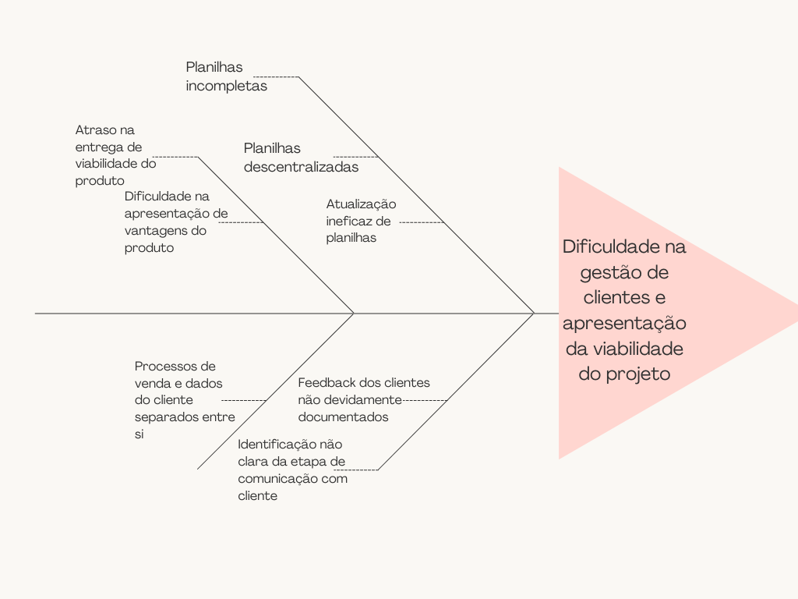

# Visão Geral do Produto

## Problema
### 5 Porquês
Problema: Os representantes se queixaram da dificuldade de captação de clientes.

- Porque há dificuldade? Porque o produtor rural não é facilmente convencido dos lucros e benefícios da armazenagem.
- Porque não é facilmente convencido? Porque a apresentação do produto é confusa e pouco intuitiva.
- Porque a apresentação é confusa? Porque é realizada a partir um método ultrapassado de planilhas com estimativas complexas e deslocalizadas.
- Porque são usadas planilhas nessas configurações? Porque os representantes são os responsáveis por fazer toda a apresentação desses dados, seguindo os padrões prévios do treinamento de vendas.

## Declaração de Posição do Produto	
|   |   |
|---|---|
| __Para__ | Representantes da EGL (empresa montadora de silos, secadores e armazéns de grãos) |
| __Quem__ | Vendedores que desejam auxílio na captação de clientes e na organização dos processos  |
| __O__ | Armazenaí |
| __Que__ | É uma ferramenta que facilitará a gestão de clientes e auxiliará na realização do estudo de viabilidade financeira na compra de armazéns e secadores de grãos da empresa EGL e na rastreabilidade dos processsos de pedidos |
| __Diferente de__ | Soluções da empresa como planilhas no Excel e documento no Word |
| __Nosso Produto__ | Preencherá essa lacuna da necessidade de elucidação a produtor rural dos benefícios da armazenagem de grãos para atuar como reforço ao fechamento de negócio e na construção de um histórico do cliente além de trabalhar na melhor comunicação e gerência dos clientes nas diversas etapas de venda |

## Objetivo do Produto
 **A ferramenta Armazenaí tem como objetivo melhorar a realização do estudo de viabilidade financeira na compra de armazéns e secadores de grãos da empresa EGL, a fim de simular previamente sua lucratividade e resultados positivos ou não, para que assim, esse processo entre o cliente e aquele que detém a propriedade sobre esses serviços industriais seja mais rápido, compacto e intuitivo, além de seguro e confiável. Tabém pretende rastrear o processo de pedidos e criar uma base de dados para manter o histórico de cada cliente e contribuir para a melhor compreensão e localização de cada etapa de venda para cada cliente, desde apresentação do produto até a realização e acompanhamento do mesmo**

## Tecnologias a Serem Utilizadas
**A ferramenta trata-se de uma aplicação web onde será utilizado o React com o back-end sendo constrúido com o Supabase, uma alternativa open-source e mais simples de utilizar que o Firebase.**

 - React
 - Supabase
 - Banco de dados POSTGRESQL 

## Histórico de revisões

| Data | Versão | Descrição | Autor |
|---|---|---|---|
| 19/04/2023 | 0.1 | Criação do documento | Kaio Enzo Melo |
| 20/04/2023 | 0.2 | Conclusão da visão geral do produto | Lara Giuliana |
| 20/04/2023 | 0.2 | Atualização da visão geral do produto | Kaio Melo |
| 17/05/2023 | 0.3 | Atualização da visão geral do produto | Lucas Meireles e Kaio Melo |
| 17/05/2023 | 0.3 | Atualização da imagem de Espinha de Peixe | Lucas Meireles e Lara Giuliana |
| 11/07/2023 | 0.4 | Atualização da visão geral do produto | Kaio Enzo |
