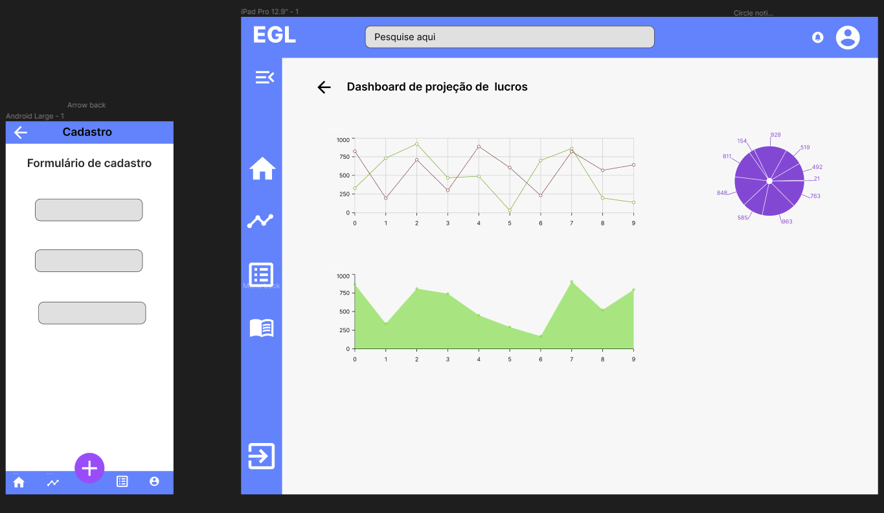

# Arquitetura
## Tipo de arquitetura:
### PWA -  Progressive Web Application +  SPA - Single Page Application em Client Server Side

**Motivos que levaram a escolha de um PWA com SPA**:

- Requisitos funcionais como: a necessidade exibir uma série de dashboard e gráficos para serem exibidos em dispositivos maiores, mas também a versatilidade de ter telas simples que serão mais utilizadas em dispositivos menores como celulares e tablets.
 - Requisitos não funcionais: 
Necessidade de ser multiplataforma
Não necessita de acesso a APIs nativas dos dispositivos móveis
Conhecimento da equipe é mais sólido no desenvolvimento web do que mobile nativo/híbrido
- Prazo e experiência da equipe: devido ao curto prazo da matéria foi escolhido algo que o squad já possui mais conhecimento, acelerando o desenvolvimento
Atualização dinâmica da página, proporcionando para o usuário, uma experiência fluída e responsiva.

**Prós da arquitetura**:

- Experiência de usuário similar a aplicativos nativos
Multiplataforma
- Facilidade de instalação e atualização/deploy

**Contras**:

- Falta de acesso a certos recursos nativos nos dispositivos móveis
- Performance um pouco menor que apps nativos

## Estilo de arquitetura
### Flux (React) + Arquitetura baseada em componentes -
**Motivos da escolha de uma arquitetura combinada entre Flux e baseada em componentes**:

- Reutilização de código
- Alta escalabilidade e boa manutenibilidade 
- Separação da responsabilidade de cada componente, visto que a aplicação tem várias features diferentes e com certo grau de independência
- Utilização com React

**Prós**:

- Atualizações atômicas e fluídas na página.
- Dependências do lado do cliente carregadas na inicialização.
- Os carregamentos subsequentes são rápidos devido ao uso do cache.

**Contras**:

- Alto custo de carga inicial.
- O desempenho depende do hardware do dispositivo e da conexão de rede.
- A complexidade adicional do aplicativo é necessária.

## Resumo de arquitetura
Nosso app utilizará o back-end construído com a ferramenta Supabase, que serve como um client back-end de fácil configuração e provêm as ferramentas necessárias para a execução do projeto, como segurança dos dados via login OAtuh2, segurança da base de dados, escalabilidade, ausência de deploy, comunicação via API REST.

## Protótipo de interface 
### Interface

#### Dashboard
- Menu com o índice de navegação na lateral 
- Cabeçalho superior, com a logo do projeto, barra de pesquisa e link para o perfil do usuário
- Gráficos no centro

#### Gerenciamento de orçamento e clientes
- Menu com o índice de navegação na lateral 
- Cabeçalho superior, com a logo do projeto, barra de pesquisa e link para o perfil do usuário
- A página será acessada a partir do dashboard
- A página conterá formulário inicial, tanto para os cálculos de viabilidade quanto para serem recuperados os dados nos orçamentos
 
## Histórico de revisões

| Data | Versão | Descrição | Autor |
|---|---|---|---|
| 27/04/2023 | 0.1 | Criação do documento | Lara Giuliana |
| 08/05/2023 | 0.2 | Definição de arquitetura e protótipo de interface | Kaio Melo  |
| 13/05/2023 | 0.3 | Adição de descrição de interface | Lara Giuliana  |
